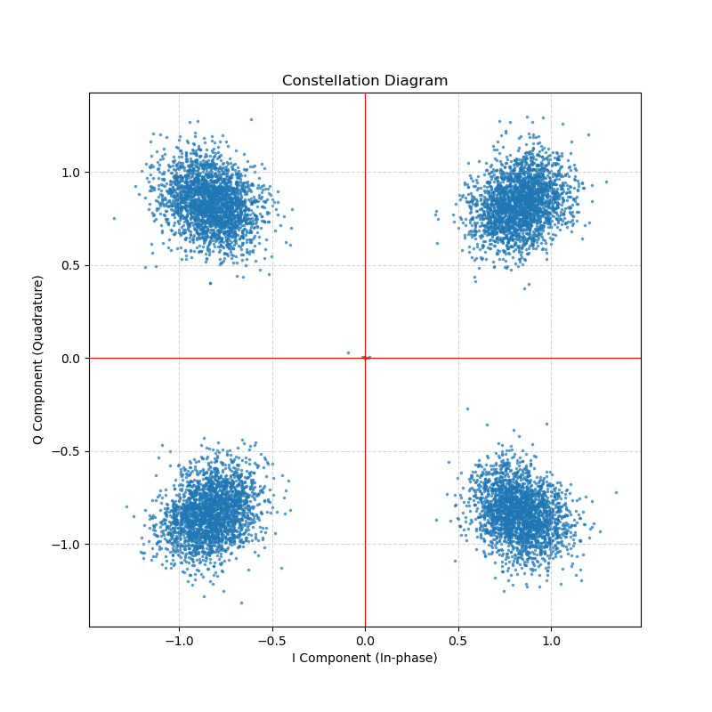

# Orbcomm_Demodulator

**Orbcomm_Demodulator** is a Python-based toolkit for demodulating **ORBCOMM** satellite downlink signals.  
This project was originally developed to process **raw voltage data captured by the 21CMA (21 Centimeter Array)** radio telescope, and aims to provide a **complete, standardized processing pipeline** from raw samples to decoded ORBCOMM data packets.

---

## Core Pipeline Features
The demodulation chain includes:

* **Digital Down Conversion (DDC)** for raw high-rate samples.
* **Symbol Timing Recovery** using Gardner TED and Farrow interpolator.
* **Carrier Phase Recovery** via a 2nd-order Costas Loop.
* **Differential Decoding** and **Frame Synchronization**.
* **Fletcher-16 Checksum** with 1-bit Error Correction (ECC).

---

## Installation

You can install the package directly from GitHub using:

```bash
pip install git+https://github.com/JinYi1108/Orbcomm_Demodulator.git
```
For development and debugging, an editable installation is recommended:
```bash
git clone https://github.com/JinYi1108/Orbcomm_Demodulator.git
cd Orbcomm_Demodulator
pip install -e .
```
---
## Examples and Test Data

Several example scripts are provided in the `examples/` directory, along with sample data in `raw_data/`.

#### Data 1: `raw_data/20250415-1940-0.dat`
- Raw voltage data recorded by the **21CMA** radio telescope
- Data format: `int16`

#### Data 2: `raw_data/1552071892p6.dat`

- The original data `1552071892p6.mat` from **ORBCOMM-receiver** (https://github.com/fbieberly/ORBCOMM-receiver/tree/master/data) has been downsampled and filtered to generate the baseband IQ file `1552071892p6.dat`



---

## Acknowledgements

This project is developed based on **ORBCOMM-receiver** project by **Frank Bieberly** (https://github.com/fbieberly/ORBCOMM-receiver).  
