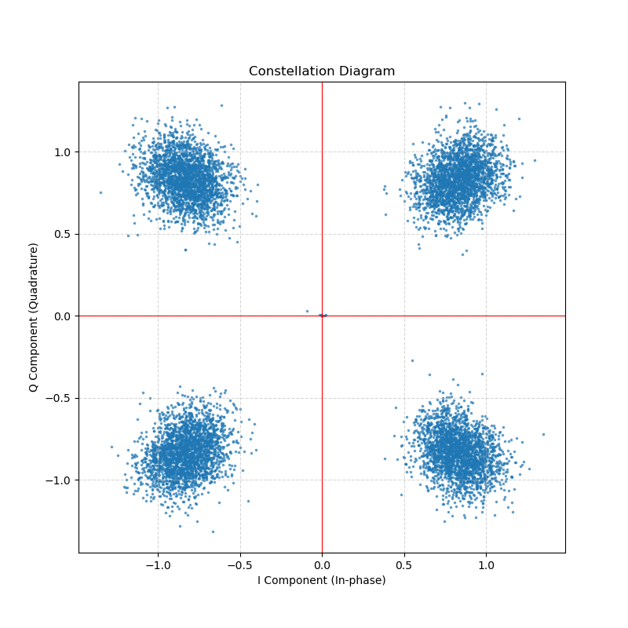

# Orbcomm_Demodulator 
[](https://badge.fury.io/py/orbdemod)
[](https://doi.org/10.5281/zenodo.18214211)

**Orbcomm_Demodulator** is a Python-based toolkit for demodulating **ORBCOMM** satellite downlink signals.  
This project was originally developed to process **raw voltage data captured by the 21CMA (21 Centimeter Array)** radio telescope, and aims to provide a **complete, standardized processing pipeline** from raw samples to decoded ORBCOMM data packets.

---

## Core Pipeline Features
The demodulation chain includes:

* **Digital Down Conversion (DDC)** for raw high-rate samples.
* **Symbol Timing Recovery** using Gardner TED and Farrow interpolator.
* **Carrier Phase Recovery** via a 2nd-order Costas Loop.
* **Differential Decoding** and **Frame Synchronization**.
* **Fletcher-16 Checksum** with 1-bit Error Correction (ECC).

---

## Installation

####  From PyPI (Recommended)
You can install the stable version directly via `pip`:
```bash
pip install orbdemod
```

#### From GitHub
You can install the package directly from GitHub using:

```bash
pip install git+https://github.com/JinYi1108/Orbcomm_Demodulator.git
```

#### From Source (For Development)
For development and debugging, an editable installation is recommended:
```bash
git clone https://github.com/JinYi1108/Orbcomm_Demodulator.git
cd Orbcomm_Demodulator
pip install -e .
```
---
## Examples and Test Data

Example scripts are provided in the `examples/` directory. Due to storage limits, large raw datasets are hosted on Zenodo.

#### 1. Raw Voltage Data (21CMA)
- **File**: `20250415-1940-0.dat` (approx. 8 GB)
- **Source**: Raw voltage data recorded by the **21CMA** radio telescope.
- **Download**: [Available on Zenodo (DOI: 10.5281/zenodo.18213739)](https://zenodo.org/records/18213739)

#### 2. DDC Processed IQ Data (21CMA)
- **File**: `raw_data/iq_data_0.dat`
- **Description**: This is the IQ data generated from the raw 21CMA `.dat` file after Digital Down Conversion (DDC). It is provided for quick testing of the backend stages (STR, Costas, etc.).

#### 3. Test Data (from ORBCOMM-receiver)
- **File**: `raw_data/1552071892p6.dat`
- **Description**: Derived from the original `1552071892p6.mat` from Frank Bieberly's project. It has been downsampled and filtered to a baseband IQ format.




---

## Acknowledgements

This project is developed based on **ORBCOMM-receiver** project by **Frank Bieberly** (https://github.com/fbieberly/ORBCOMM-receiver).  

---

## Explicit DDC filtering and decimation

The shared DDC filter stages are specified by measurable passband, stopband,
ripple, and attenuation requirements instead of fixed cutoff ratios. The
ORBCOMM-specific plan and complete voltage-to-IQ pipeline live in
`orbdemod.orbcomm.orbcomm_ddc`. The historical top-level
`ddc(data, freq_lo, fs_in, fs_mid, fs_out)` alias remains valid.

At the default ORBCOMM rates, the anti-alias path is now:

```text
480 MS/s -> 2.4 MS/s -> 96 kS/s -> 9.6 kS/s
     /200          /25          /10
```

This replaces the old direct 250-fold second-stage reduction, whose fixed
201-tap FIR did not adequately suppress the first alias band. The default
ORBCOMM passband is 4.0 kHz, the final stopband begins at 4.8 kHz, and the
requested stopband attenuation is 60 dB. These acquisition-band parameters
should be re-evaluated against real Doppler and receiver-frequency error data.

Legacy `decimate_iir` and `decimate_fir` helpers remain available for existing
callers, but new code should use `DecimationStageConfig` together with
`filter_and_decimate`.

Butterworth and Kaiser filter generation defaults to `verify=False`, so normal
data processing does not repeatedly calculate a dense frequency response. Set
`verify=True` when a newly generated filter should be checked against its
configured passband loss/ripple and stopband attenuation. IIR pole stability
and finite coefficients are checked as well, and a failed check raises a
`ValueError`:

```python
from orbdemod.ddc import (
    design_kaiser_lowpass,
    format_filter_report,
    validate_filter_response,
)
from orbdemod.orbcomm.orbcomm_ddc import make_orbcomm_decimation_stages

stage = make_orbcomm_decimation_stages()[-1]
taps = design_kaiser_lowpass(stage)
report = validate_filter_response(taps, stage)
print(format_filter_report(report))
```

When only pass/fail enforcement is needed, use
`design_kaiser_lowpass(stage, verify=True)` instead.

When a Butterworth stage is applied with zero-phase `sosfiltfilt`, verification
uses `processing_passes=2`, so the reported requirements describe the actual
two-pass response rather than a single forward pass.

---

## Experimental broadcast-FM PSD path

The `fm-dev` branch contains an offline, deliberately shallow FM path:

```text
480 MS/s int16 real voltage
  -> channel-selecting DDC
  -> 240 kS/s complex IQ
  -> quadrature FM discriminator
  -> FM composite (MPX) PSD
```

It marks the 0--15 kHz audio band, 19 kHz stereo pilot, 23--53 kHz
stereo-difference band (centred on the suppressed 38 kHz subcarrier), and
57 kHz RDS region. It does not automatically classify a window as broadcast
FM.

After an editable install, analyze one window with:

```bash
python examples/analyze_fm_psd.py \
  --input /path/to/20250415-1940-0.dat \
  --rf-frequency 100.1e6 \
  --start 0.0 \
  --duration 0.5 \
  --output-dir results/direct_100p1 \
  --label direct_100p1
```

The output directory contains `fm_psd.png`, `fm_arrays.npz`, `summary.json`,
and `run_config.json`.
